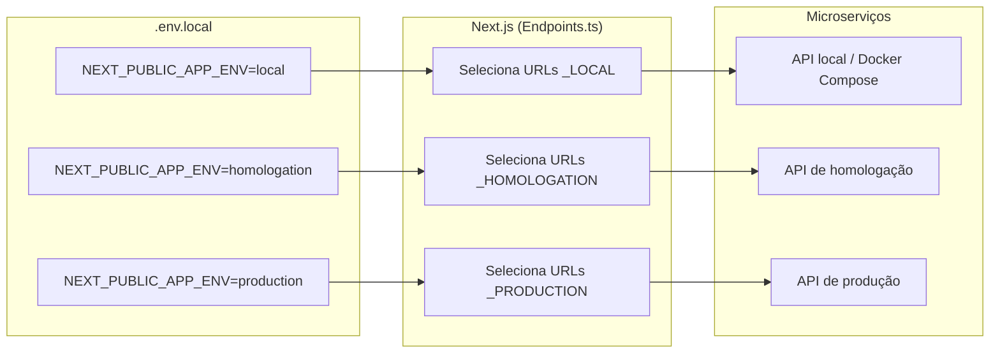

# Finlumia Frontend

Frontend da plataforma **Finlumia** — gestão financeira pessoal. Construído com **Next.js 15** (App Router), **React 19** e **TypeScript**, integrado a 4 microserviços Spring Boot via camada de serviços tipada.

---

## Sumário

- [Início rápido](#início-rápido)
- [Pré-requisitos](#pré-requisitos)
- [Configuração do ambiente](#configuração-do-ambiente)
- [Formas de execução](#formas-de-execução)
  - [1. Local sem Docker](#1-local-sem-docker)
  - [2. Docker — desenvolvimento (Windows)](#2-docker--desenvolvimento-windows)
  - [3. Docker — produção (Linux / VPS)](#3-docker--produção-linux--vps)
- [Entendendo os ambientes](#entendendo-os-ambientes)
- [Arquitetura](#arquitetura)
- [Estrutura de pastas](#estrutura-de-pastas)
- [Microserviços e endpoints](#microserviços-e-endpoints)
- [Guia de desenvolvimento](#guia-de-desenvolvimento)

---

## Início rápido

> **Quer só rodar o projeto agora?** Três passos:

```bash
# 1. Clone e entre na pasta
git clone <repo-url> && cd finlumia_frontend

# 2. Configure as variáveis de ambiente
cp .env.example .env.local
# edite .env.local com as URLs dos microserviços do seu ambiente

# 3. Suba o projeto
npm install && npm run dev          # opção A — Node local
./finlumia.ps1 -up                  # opção B — Docker (Windows)
./finlumia.sh  -up                  # opção C — Docker (Linux/VPS, modo produção)
```

Acesse [http://localhost:3000](http://localhost:3000).

---

## Pré-requisitos

Escolha **uma** das formas de execução abaixo e instale apenas os requisitos correspondentes:

| Forma | Requisitos |
|-------|------------|
| **Local** | Node.js 24 LTS + npm |
| **Docker — dev (Windows)** | Docker Desktop (com daemon em execução) + PowerShell |
| **Docker — produção (Linux/VPS)** | Docker Engine + Bash |

> O Node.js não precisa estar instalado na máquina host ao usar Docker — ele roda dentro do container.

---

## Configuração do ambiente

O arquivo `.env.local` é **obrigatório** antes de qualquer execução. Ele nunca é versionado.

```bash
cp .env.example .env.local
```

Abra `.env.local` e ajuste as variáveis para o seu ambiente:

```env
# Define qual conjunto de URLs de API usar
NEXT_PUBLIC_APP_ENV=local          # local | homologation | production

# Versão dos endpoints REST
NEXT_PUBLIC_API_VERSION=v1

# URLs dos microserviços — ambiente LOCAL
NEXT_PUBLIC_SERVICE_IDENTIFICATION_LOCAL=http://localhost:8080/identification
NEXT_PUBLIC_SERVICE_MOVIMENTATION_LOCAL=http://localhost:8080/movimentation
NEXT_PUBLIC_SERVICE_DOCUMENT_LOCAL=http://localhost:8080/document
NEXT_PUBLIC_SERVICE_CONFIGURATOR_LOCAL=http://localhost:8080/configurator

# URLs para homologação e produção (ver .env.example para lista completa)
# NEXT_PUBLIC_SERVICE_IDENTIFICATION_HOMOLOGATION=https://<seu-host-homologacao>/identification
# NEXT_PUBLIC_SERVICE_IDENTIFICATION_PRODUCTION=https://apifinlumia.identification.thiagobenevide.com
```

> **Importante:** variáveis `NEXT_PUBLIC_*` são incorporadas no build pelo Next.js. Alterar o `.env.local` após o build de produção **não** tem efeito — é necessário rebuildar.

---

## Formas de execução

### 1. Local sem Docker

Recomendado para desenvolvimento rápido com hot-reload sem overhead de container.

**Requisito:** Node.js 24+ instalado localmente.

```bash
npm install
npm run dev
```

| Comando | Descrição |
|---------|-----------|
| `npm run dev` | Servidor de desenvolvimento com hot-reload (porta 3000) |
| `npm run build` | Gera build de produção otimizado |
| `npm run start` | Serve o build de produção (requer `build` antes) |
| `npm run lint` | Verifica qualidade de código com ESLint |

---

### 2. Docker — desenvolvimento (Windows)

Usa o script `finlumia.ps1` para gerenciar um container com **hot-reload ativo** (`npm run dev`).  
O repositório é montado como volume — alterações no código aparecem imediatamente no container.

**Requisito:** Docker Desktop em execução.

```powershell
# Primeira vez (ou após alterar o Dockerfile)
./finlumia.ps1 -up -Build

# Execuções seguintes
./finlumia.ps1 -up

# Outros comandos úteis
./finlumia.ps1 -Logs     # Acompanhar logs em tempo real
./finlumia.ps1 -Shell    # Abrir terminal dentro do container
./finlumia.ps1 -down     # Parar e remover o container
```

**O que acontece internamente:**

```
docker build  →  docker run  →  npm install  →  npm run dev --hostname 0.0.0.0
```

O container expõe a porta `3000`. O `.env.local` é lido pelo Next.js a partir do volume montado em `/workspace`.

---

### 3. Docker — produção (Linux / VPS)

Usa o script `finlumia.sh` para executar o **build de produção otimizado** dentro do container.  
Indicado para servidor remoto (VPS, VM, servidor Linux). O container reinicia automaticamente após falhas ou reboots.

**Requisito:** Docker Engine instalado no servidor Linux.

```bash
chmod +x finlumia.sh

# Primeira vez (ou após atualizar o Dockerfile)
./finlumia.sh -up -Build

# Execuções seguintes (ex.: após pull de nova versão)
./finlumia.sh -up

# Outros comandos
./finlumia.sh -Logs     # Acompanhar logs (o build pode levar ~2–5 min)
./finlumia.sh -Shell    # Terminal no container
./finlumia.sh -down     # Parar e remover o container
```

**O que acontece internamente:**

```
docker build  →  docker run  →  npm install  →  npm run build  →  npm run start
                                (--include=dev)  (NODE_ENV=production)
```

> O `npm install --include=dev` é necessário porque `typescript` e `@types/*` são `devDependencies` exigidos pelo `next build`. O `NODE_ENV=production` é aplicado apenas nos comandos `build` e `start`.

O container usa `--restart unless-stopped` e o `.env.local` é passado via `--env-file` ao `docker run`.

---

## Entendendo os ambientes

```
NEXT_PUBLIC_APP_ENV  →  define qual conjunto de URLs é usado em runtime
```



| Ambiente | `APP_ENV` | Quando usar |
|----------|-----------|-------------|
| **Local** | `local` | Desenvolvimento com microserviços rodando localmente |
| **Homologação** | `homologation` | Testes integrados contra API de staging |
| **Produção** | `production` | Deploy real no servidor |

### Diferença entre os modos de execução

| Aspecto | Dev (ps1 / `npm run dev`) | Produção (sh / `npm run start`) |
|---------|---------------------------|---------------------------------|
| Hot-reload | Sim | Não |
| Build necessário | Não | Sim (antes do start) |
| Otimização | Não | Sim (minificação, tree-shaking) |
| Source maps | Sim | Não (por padrão) |
| Tempo de start | ~5 s | ~2–5 min (build) |
| Restart automático | Não | Sim (`unless-stopped`) |
| Uso recomendado | Desenvolvimento local | VPS / servidor |

---

## Arquitetura

### Fluxo de uma requisição

```
Browser
  └─▶ Next.js App Router (src/app/**/page.tsx)
        └─▶ dashboard/layout.tsx  ──┬──  TourProvider
                                    ├──  AuthContext (JWT, refresh automático)
                                    ├──  FinanceProvider (catálogos + transações)
                                    └──  Sidebar
        └─▶ components/pages/<Page>.tsx
              └─▶ services/<domínio>/<serviço>.ts  (fetch + Bearer token)
                    └─▶ Microserviço Spring Boot (identification / movimentation / document / configurator)
```

### Camadas

| Camada | Localização | Responsabilidade |
|--------|-------------|------------------|
| **Rotas** | `src/app/**/page.tsx` | Declaração de URL, metadata, layout aninhado |
| **Pages** | `src/components/pages/` | Telas completas, orquestram contextos e serviços |
| **Organisms** | `src/components/organisms/` | Seções complexas reutilizáveis (Sidebar, Modal, DataTable…) |
| **Atoms / Molecules** | `src/components/atoms/` | Primitivos visuais (Button, Input, Charts…) |
| **Contexts** | `src/contexts/` | Estado global: auth, tour |
| **Shared state** | `src/shared/finance/` | Estado financeiro compartilhado no dashboard |
| **Services** | `src/services/<domínio>/` | Clientes HTTP por microserviço |
| **HTTP Client** | `src/lib/http-client.ts` | fetch wrapper com refresh de token JWT (401 automático) |
| **Endpoints** | `src/api/Endpoints.ts` | Catálogo central de URLs, seleção por ambiente |
| **Tipos API** | `src/api/types.ts` | Tipos TypeScript dos contratos de cada serviço |

### Autenticação

```
Login  →  POST /auth/login  →  { accessToken, refreshToken }
                                    ↓
                            localStorage (chaves internas)
                                    ↓
                    Toda requisição: Authorization: Bearer <accessToken>
                                    ↓
                          401 recebido?  →  POST /auth/refresh
                                              ↓ sucesso: retry original
                                              ↓ falha: redirect /login
```

---

## Estrutura de pastas

```text
finlumia_frontend/
│
├── docker/scripts/
│   └── finlumia_front.Dockerfile   # AlmaLinux 10 + Node 24 + Docker CLI
│
├── .devcontainer/                   # Dev Container (VS Code / Cursor)
│
├── public/assets/                   # Logo, favicon, imagens estáticas
│
├── src/
│   ├── app/                         # App Router — rotas e layouts Next.js
│   │   ├── layout.tsx               # Raiz: ThemeProvider + globals
│   │   ├── page.tsx                 # Landing page (/)
│   │   ├── login/                   # /login
│   │   ├── register/                # /register
│   │   ├── forgot-password/         # /forgot-password
│   │   ├── reset-password/          # /reset-password
│   │   └── dashboard/               # Área autenticada (/dashboard/*)
│   │       ├── layout.tsx           # TourProvider + AuthGuard + FinanceProvider + Sidebar
│   │       ├── movimentation/       # Transações, orçamento, categorias, bancos
│   │       ├── reports/             # Relatórios e gráficos
│   │       ├── configurator/        # CRUD de metadados (tabelas, campos, usuários…)
│   │       └── support/             # Tickets e documentação
│   │
│   ├── api/
│   │   ├── Endpoints.ts             # Monta URLs selecionando por NEXT_PUBLIC_APP_ENV
│   │   ├── types.ts                 # Tipos de request/response de todos os serviços
│   │   └── endpoints/               # Contratos JSON por domínio
│   │
│   ├── components/
│   │   ├── atoms/                   # Button, Input, Charts, Text…
│   │   ├── molecules/               # Logo, composições simples
│   │   ├── organisms/               # Sidebar, Modal, DataTable, ImportModal…
│   │   │   └── Tour/                # TourOverlay — tutorial interativo
│   │   └── pages/                   # Telas completas (sem rota Next.js própria)
│   │
│   ├── contexts/
│   │   ├── auth.context.tsx         # useAuth() — user, tokens, isAuthenticated
│   │   └── tour.context.tsx         # useTour() — tutorial de onboarding
│   │
│   ├── lib/
│   │   └── http-client.ts           # fetch wrapper com JWT e auto-refresh
│   │
│   ├── services/
│   │   ├── identification/          # authService, profileService
│   │   ├── configurator/            # configuratorService
│   │   ├── movimentation/           # transactionsService, categoriesService…
│   │   └── document/                # reportsService, exportService
│   │
│   ├── config/
│   │   ├── navigation.json          # Estrutura declarativa do menu lateral
│   │   └── transactions.ts          # Tipos e catálogos padrão
│   │
│   └── shared/
│       ├── finance/
│       │   └── finance.context.tsx  # Catálogos + transações (useFinance())
│       └── styles/
│           ├── tokens/              # Design tokens: cores, tipografia (light/dark)
│           ├── theme.context.tsx    # useTheme() — alternância claro/escuro
│           ├── globals.css
│           ├── theme.css
│           └── responsive.css       # .page-responsive, .grid-responsive
│
├── finlumia.ps1                     # Gerenciador Docker — Windows (dev)
├── finlumia.sh                      # Gerenciador Docker — Linux/VPS (produção)
├── .env.example                     # Modelo de variáveis de ambiente
├── next.config.ts
├── tsconfig.json
└── package.json
```

---

## Microserviços e endpoints

O frontend consome 4 microserviços Spring Boot. As URLs são selecionadas automaticamente em `src/api/Endpoints.ts` com base em `NEXT_PUBLIC_APP_ENV`.

| Microserviço | Variável de ambiente | Responsabilidade |
|--------------|----------------------|------------------|
| **identification** | `NEXT_PUBLIC_SERVICE_IDENTIFICATION_*` | Login, cadastro, tokens JWT, perfil |
| **movimentation** | `NEXT_PUBLIC_SERVICE_MOVIMENTATION_*` | Transações, categorias, bancos, importação |
| **document** | `NEXT_PUBLIC_SERVICE_DOCUMENT_*` | Relatórios, gráficos, exportação |
| **configurator** | `NEXT_PUBLIC_SERVICE_CONFIGURATOR_*` | Metadados: tabelas, campos, usuários, permissões |

### Cliente HTTP (`src/lib/http-client.ts`)

Todas as chamadas passam pelo wrapper centralizado que:
- Injeta `Authorization: Bearer <token>` automaticamente
- Detecta `401` e tenta refresh antes de retentar
- Suporta `{ skipAuth: true }` para endpoints públicos (ex.: categorias)

```ts
import { http } from "@/lib/http-client";

// Endpoint autenticado
const data = await http.get<Transaction[]>("/transactions");

// Endpoint público
const cats = await http.get<Category[]>("/categories", { skipAuth: true });
```

---

## Guia de desenvolvimento

### Adicionar uma rota

```text
src/app/minha-rota/page.tsx  →  acessível em /minha-rota
```

```tsx
// src/app/dashboard/minha-rota/page.tsx
import { MinhaPage } from "@/components/pages/MinhaPage";

export const metadata = { title: "Minha rota | Finlumia" };

export default function Page() {
  return <MinhaPage />;
}
```

Use `"use client"` quando a page ou componente usar hooks, eventos ou contexto.

### Adicionar item ao menu lateral

1. Edite `src/config/navigation.json` — adicione o item ou `children`.
2. Se o ícone for novo, registre-o no mapa `ICONS` em `Sidebar.tsx`.

### Criar um componente (Atomic Design)

| Onde colocar | Critério |
|--------------|----------|
| `atoms/` | Primitivo visual sem lógica de negócio (ex.: botão, campo) |
| `molecules/` | Composição de 2–3 atoms (ex.: campo com label) |
| `organisms/` | Seção complexa com estado ou contexto (ex.: modal, tabela) |
| `pages/` | Tela completa composta de organisms |

```text
src/components/atoms/MeuComponente/
  ├── MeuComponente.tsx
  └── index.ts          ← re-exporta para import limpo
```

### Estilos

- **CSS Modules** (`.module.css`) — layout e estados de componente
- **Inline `style`** com `getFoundationByTheme(theme)` — cores dinâmicas por tema
- **Classes globais** — `.page-responsive`, `.grid-responsive` para padrões repetidos

```tsx
import { useTheme } from "@/shared/styles/theme.context";
import { getFoundationByTheme } from "@/shared/styles/tokens";

const { theme } = useTheme();
const f = getFoundationByTheme(theme);  // tokens de cor do tema atual
```

### Typecheck manual

```bash
node ./node_modules/typescript/bin/tsc --noEmit
```

### Convenções de commit

```
feat: adiciona importação via OCR
fix: corrige cálculo de taxa de poupança
refactor: extrai lógica de refresh para http-client
```

- Mensagens em português, foco no **porquê**
- PRs por módulo (UI, rota, serviço) — não misturar domínios
- Nunca commitar `.env.local` nem tokens/senhas

---

## Variáveis de ambiente — referência completa

| Variável | Valores | Descrição |
|----------|---------|-----------|
| `NEXT_PUBLIC_APP_ENV` | `local` \| `homologation` \| `production` | Seleciona o conjunto de URLs ativo |
| `NEXT_PUBLIC_API_VERSION` | `v1` | Prefixo de versão nos paths da API |
| `NEXT_PUBLIC_SERVICE_IDENTIFICATION_*` | URL | Base do serviço de autenticação |
| `NEXT_PUBLIC_SERVICE_MOVIMENTATION_*` | URL | Base do serviço de transações |
| `NEXT_PUBLIC_SERVICE_DOCUMENT_*` | URL | Base do serviço de relatórios |
| `NEXT_PUBLIC_SERVICE_CONFIGURATOR_*` | URL | Base do serviço de configuração |
| `NEXT_PUBLIC_GOOGLE_CLIENT_ID` | string | Client ID para OAuth Google |
| `NEXT_PUBLIC_FEATURE_IMPORT_ENABLED` | `true` \| `false` | Feature flag de importação de extratos |
| `NEXT_PUBLIC_FEATURE_MFA_ENABLED` | `true` \| `false` | Feature flag de autenticação MFA |

O sufixo `*` substitui o ambiente: `_LOCAL`, `_HOMOLOGATION` ou `_PRODUCTION`.

---

## Docker — referência da imagem

| Item | Detalhe |
|------|---------|
| Base | `almalinux:10.1-minimal` |
| Runtime | Node.js 24 LTS (via NodeSource) |
| Extras | Git, Python 3, GCC (para módulos nativos npm), Docker CLI |
| Usuário | `finlumia` (não-root) |
| Workdir | `/workspace` (repositório montado como volume) |
| Porta exposta | `3000` |
| Dockerfile | `docker/scripts/finlumia_front.Dockerfile` |

---

## Rotas da aplicação

### Públicas (sem autenticação)

| Rota | Tela |
|------|------|
| `/` | Landing page — hero, recursos, FAQ, CTA |
| `/login` | Autenticação e-mail + senha |
| `/register` | Cadastro com validação e aceite de termos |
| `/forgot-password` | Solicitação de redefinição de senha |
| `/reset-password` | Redefinição com token |

### Dashboard (`/dashboard/*`)

| Rota | Módulo |
|------|--------|
| `/dashboard` | Painel — KPIs e movimentações recentes |
| `/dashboard/movimentation/transactions` | Transações — CRUD + importação de extrato |
| `/dashboard/movimentation/budget` | Orçamentos mensais com alertas de estouro |
| `/dashboard/movimentation/categories` | Catálogo de categorias |
| `/dashboard/movimentation/banks` | Catálogo de bancos |
| `/dashboard/movimentation/payment-methods` | Formas de pagamento |
| `/dashboard/reports` | Relatórios — gráficos, insights e evolução |
| `/dashboard/configurator/tables` | Metadados — tabelas |
| `/dashboard/configurator/fields` | Metadados — campos |
| `/dashboard/configurator/users` | Metadados — usuários |
| `/dashboard/configurator/permissions` | Metadados — permissões |
| `/dashboard/configurator/functions` | Metadados — funções |
| `/dashboard/configurator/indexes` | Metadados — índices |
| `/dashboard/configurator/triggers` | Metadados — triggers |
| `/dashboard/support/ticket` | Abertura de chamado |
| `/dashboard/support/documentation` | Documentação interna |

---

*Projeto privado — `"private": true` em `package.json`.*
