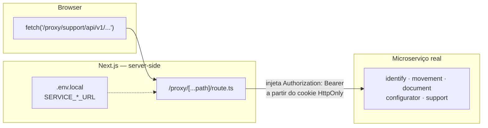

# Finlumia Frontend

Frontend da plataforma **Finlumia** — gestão financeira pessoal. Construído com **Next.js 15** (App Router), **React 19** e **TypeScript**, integrado a 5 microserviços Spring Boot através de um proxy server-side (nenhuma URL de backend ou token chega ao browser).

---

## Sumário

- [Início rápido](#início-rápido)
- [Pré-requisitos](#pré-requisitos)
- [Configuração do ambiente](#configuração-do-ambiente)
- [Formas de execução](#formas-de-execução)
  - [1. Local sem Docker](#1-local-sem-docker)
  - [2. Docker — desenvolvimento (Windows)](#2-docker--desenvolvimento-windows)
  - [3. Docker — produção (Linux / VPS)](#3-docker--produção-linux--vps)
- [Entendendo os ambientes](#entendendo-os-ambientes)
- [Arquitetura](#arquitetura)
- [Estrutura de pastas](#estrutura-de-pastas)
- [Microserviços e endpoints](#microserviços-e-endpoints)
- [Guia de desenvolvimento](#guia-de-desenvolvimento)

---

## Início rápido

> **Quer só rodar o projeto agora?** Três passos:

```bash
# 1. Clone e entre na pasta
git clone <repo-url> && cd finlumia_frontend

# 2. Configure as variáveis de ambiente
cp .env.example .env.local
# edite .env.local com as URLs dos microserviços do seu ambiente

# 3. Suba o projeto
npm install && npm run dev          # opção A — Node local
./finlumia.ps1 -up                  # opção B — Docker (Windows)
./finlumia.sh  -up                  # opção C — Docker (Linux/VPS, modo produção)
```

Acesse [http://localhost:3000](http://localhost:3000).

---

## Pré-requisitos

Escolha **uma** das formas de execução abaixo e instale apenas os requisitos correspondentes:

| Forma | Requisitos |
|-------|------------|
| **Local** | Node.js 24 LTS + npm |
| **Docker — dev (Windows)** | Docker Desktop (com daemon em execução) + PowerShell |
| **Docker — produção (Linux/VPS)** | Docker Engine + Bash |

> O Node.js não precisa estar instalado na máquina host ao usar Docker — ele roda dentro do container.

---

## Configuração do ambiente

O arquivo `.env.local` é **obrigatório** antes de qualquer execução. Ele nunca é versionado.

```bash
cp .env.example .env.local
```

Diferente de um setup tradicional de SPA, **nenhuma URL de backend é exposta ao browser**. Toda chamada da UI passa por um proxy Next.js server-side (`/proxy/<serviço>/*`, implementado em [`src/app/proxy/[...path]/route.ts`](src/app/proxy/%5B...path%5D/route.ts)), que lê as variáveis abaixo **no servidor** e encaminha a requisição ao microserviço real — o navegador nunca vê `SERVICE_*_URL`, nem o token JWT (ver [Autenticação](#autenticação)).

```env
# ── PROXY SERVER-TO-SERVER (sem NEXT_PUBLIC — nunca chegam ao bundle do browser)
SERVICE_IDENTIFICATION_URL=http://localhost:28083
SERVICE_MOVIMENTATION_URL=http://localhost:28084
SERVICE_DOCUMENT_URL=http://localhost:28085
SERVICE_CONFIGURATOR_URL=http://localhost:28081
SERVICE_SUPPORT_URL=http://localhost:28082

# ── AUTENTICAÇÃO GOOGLE OAUTH — único valor público exigido
NEXT_PUBLIC_GOOGLE_CLIENT_ID=<client-id>.apps.googleusercontent.com

# ── FEATURE FLAGS (opcional)
NEXT_PUBLIC_FEATURE_IMPORT_ENABLED=false
NEXT_PUBLIC_FEATURE_MFA_ENABLED=true
```

Não existe uma chave `APP_ENV` que troca o conjunto de URLs em runtime — o `.env.local` tem **um único conjunto de valores**, apontando para onde quer que os 5 microserviços estejam rodando naquele momento. Trocar de ambiente (local → homologação → produção) é trocar o conteúdo do arquivo, não uma flag (ver [Entendendo os ambientes](#entendendo-os-ambientes)).

> ⚠️ **Rodando o frontend dentro de um container Docker** (`./finlumia.ps1 -up`)**?** `localhost` dentro do container aponta para o próprio container — nunca para o host, nem para outros containers. Se os 5 backends rodam em containers separados publicando portas no host, troque `localhost` por `host.docker.internal` nas 5 variáveis `SERVICE_*_URL` (ex.: `http://host.docker.internal:28083`). O `finlumia.ps1` já registra esse hostname no container (`--add-host host.docker.internal:host-gateway`); só falta usar o valor certo no `.env.local` — e reiniciar o container depois de editar, já que o Next.js só lê `.env.local` na subida do processo.
>
> Variáveis `NEXT_PUBLIC_*` (Google Client ID, feature flags) são incorporadas no build pelo Next.js. Alterar o `.env.local` após o build de produção **não** tem efeito nelas — é necessário rebuildar. As `SERVICE_*_URL`, por serem lidas só em runtime pelo servidor, não têm essa limitação.

---

## Formas de execução

### 1. Local sem Docker

Recomendado para desenvolvimento rápido com hot-reload sem overhead de container.

**Requisito:** Node.js 24+ instalado localmente.

```bash
npm install
npm run dev
```

| Comando | Descrição |
|---------|-----------|
| `npm run dev` | Servidor de desenvolvimento com hot-reload (porta 3000) |
| `npm run build` | Gera build de produção otimizado |
| `npm run start` | Serve o build de produção (requer `build` antes) |
| `npm run lint` | Verifica qualidade de código com ESLint |

---

### 2. Docker — desenvolvimento (Windows)

Usa o script `finlumia.ps1` para gerenciar um container com **hot-reload ativo** (`npm run dev`).  
O repositório é montado como volume — alterações no código aparecem imediatamente no container.

**Requisito:** Docker Desktop em execução.

```powershell
# Primeira vez (ou após alterar o Dockerfile)
./finlumia.ps1 -up -Build

# Execuções seguintes
./finlumia.ps1 -up

# Outros comandos úteis
./finlumia.ps1 -Logs     # Acompanhar logs em tempo real
./finlumia.ps1 -Shell    # Abrir terminal dentro do container
./finlumia.ps1 -down     # Parar e remover o container
```

**O que acontece internamente:**

```
docker build  →  docker run  →  npm install  →  npm run dev --hostname 0.0.0.0
```

O container expõe a porta `3000`. O `.env.local` é lido pelo Next.js a partir do volume montado em `/workspace`.

---

### 3. Docker — produção (Linux / VPS)

Usa o script `finlumia.sh` para executar o **build de produção otimizado** dentro do container.  
Indicado para servidor remoto (VPS, VM, servidor Linux). O container reinicia automaticamente após falhas ou reboots.

**Requisito:** Docker Engine instalado no servidor Linux.

```bash
chmod +x finlumia.sh

# Primeira vez (ou após atualizar o Dockerfile)
./finlumia.sh -up -Build

# Execuções seguintes (ex.: após pull de nova versão)
./finlumia.sh -up

# Outros comandos
./finlumia.sh -Logs     # Acompanhar logs (o build pode levar ~2–5 min)
./finlumia.sh -Shell    # Terminal no container
./finlumia.sh -down     # Parar e remover o container
```

**O que acontece internamente:**

```
docker build  →  docker run  →  npm install  →  npm run build  →  npm run start
                                (--include=dev)  (NODE_ENV=production)
```

> O `npm install --include=dev` é necessário porque `typescript` e `@types/*` são `devDependencies` exigidos pelo `next build`. O `NODE_ENV=production` é aplicado apenas nos comandos `build` e `start`.

O container usa `--restart unless-stopped` e o `.env.local` é passado via `--env-file` ao `docker run`.

---

## Entendendo os ambientes

Não há chave de runtime que troca "ambiente" — o único artefato que muda entre local, homologação e produção é o **conteúdo do `.env.local`**. O caminho da requisição é sempre o mesmo:



| Onde roda | `SERVICE_*_URL` aponta para | Exemplo |
|-----------|------------------------------|---------|
| **Local, sem Docker** | Backends rodando direto no host | `http://localhost:28083` |
| **Local, frontend em Docker** | Backends em containers separados — `localhost` não funciona aqui | `http://host.docker.internal:28083` |
| **Produção (VPS)** | Subdomínio dedicado por serviço | `https://apifinlumia.identification.thiagobenevide.com` |

O arquivo [`.env.example`](.env.example) já vem com as três variantes comentadas por serviço — descomente/edite a que corresponde ao seu caso.

### Diferença entre os modos de execução

| Aspecto | Dev (ps1 / `npm run dev`) | Produção (sh / `npm run start`) |
|---------|---------------------------|---------------------------------|
| Hot-reload | Sim | Não |
| Build necessário | Não | Sim (antes do start) |
| Otimização | Não | Sim (minificação, tree-shaking) |
| Source maps | Sim | Não (por padrão) |
| Tempo de start | ~5 s | ~2–5 min (build) |
| Restart automático | Não | Sim (`unless-stopped`) |
| Uso recomendado | Desenvolvimento local | VPS / servidor |

---

## Arquitetura

### Fluxo de uma requisição

```
Browser
  └─▶ Next.js App Router (src/app/**/page.tsx)
        └─▶ dashboard/layout.tsx  ──┬──  TourProvider
                                    ├──  AuthContext (sessão via cookie HttpOnly, sem token no client)
                                    ├──  FinanceProvider (catálogos + transações)
                                    └──  Sidebar
        └─▶ components/pages/<Page>.tsx
              └─▶ services/<domínio>/*.service.ts ou lib/<domínio>.api.ts  (http-client → /proxy/<serviço>/*)
                    └─▶ src/app/proxy/[...path]/route.ts  (injeta Bearer a partir do cookie)
                          └─▶ Microserviço Spring Boot (identify / movement / document / configurator / support)
```

### Camadas

| Camada | Localização | Responsabilidade |
|--------|-------------|------------------|
| **Rotas** | `src/app/**/page.tsx` | Declaração de URL, metadata, layout aninhado |
| **Pages** | `src/components/pages/` | Telas completas, orquestram contextos e serviços |
| **Organisms** | `src/components/organisms/` | Seções complexas reutilizáveis (Sidebar, Modal, DataTable…) |
| **Atoms / Molecules** | `src/components/atoms/` | Primitivos visuais (Button, Input, Charts…) |
| **Contexts** | `src/contexts/` | Estado global: auth, tour |
| **Shared state** | `src/shared/finance/` | Estado financeiro compartilhado no dashboard |
| **Services** | `src/services/<domínio>/*.service.ts` | Clientes HTTP por microserviço (identification, movimentation, document, configurator) |
| **Lib API clients** | `src/lib/<domínio>.api.ts` | Mesmo papel dos Services, para módulos mais novos (ex.: `support.api.ts`) |
| **Proxy** | `src/app/proxy/[...path]/route.ts` | Único ponto que conhece as URLs reais dos backends; injeta o Bearer e faz refresh transparente |
| **HTTP Client** | `src/lib/http-client.ts` | fetch wrapper — sempre `credentials:"same-origin"`, trata 401 residual (redirect `/login`) |
| **Endpoints** | `src/api/Endpoints.ts` | Catálogo central de rotas, todas prefixadas com `/proxy/<serviço>` |
| **Tipos API** | `src/api/types.ts` | Tipos TypeScript dos contratos de cada serviço |

### Autenticação

Os tokens JWT **nunca chegam ao JavaScript do browser** — vivem em cookies `HttpOnly` (`finlumia_access`, `finlumia_refresh`) gerenciados por rotas server-side do Next.js. O `localStorage` só guarda preferências de UI (tema, progresso do tour), nunca credenciais.

```
Login  →  POST /api/auth/login (route handler — não é o backend direto)
              └─▶ backend identify  →  { accessToken, refreshToken }
                        └─▶ Next.js seta cookies HttpOnly finlumia_access / finlumia_refresh

Toda chamada a /proxy/<serviço>/*
              └─▶ proxy lê o cookie finlumia_access e injeta Authorization: Bearer <token>

401 do backend?  →  proxy tenta refresh automático com finlumia_refresh
                     (dedup de ~5s entre requisições concorrentes que expiram juntas)
                        ↓ sucesso: retenta a chamada original, rotaciona os 2 cookies
                        ↓ falha: limpa os cookies, retorna 401 → cliente redireciona /login
```

Rotas relevantes: `src/app/api/auth/{login,google,logout}/route.ts` (definem/removem os cookies) e `src/app/proxy/[...path]/route.ts` (injeta o Bearer e faz o refresh transparente para todo `/proxy/<serviço>/*`).

---

## Estrutura de pastas

```text
finlumia_frontend/
│
├── docker/scripts/
│   └── finlumia_front.Dockerfile   # AlmaLinux 10 + Node 24 + Docker CLI
│
├── .devcontainer/                   # Dev Container (VS Code / Cursor)
│
├── public/assets/                   # Logo, favicon, imagens estáticas
│
├── src/
│   ├── app/                         # App Router — rotas e layouts Next.js
│   │   ├── layout.tsx               # Raiz: ThemeProvider + globals
│   │   ├── page.tsx                 # Landing page (/)
│   │   ├── login/                   # /login
│   │   ├── register/                # /register
│   │   ├── forgot-password/         # /forgot-password
│   │   ├── reset-password/          # /reset-password
│   │   ├── privacy/, terms/         # Páginas públicas de política e termos
│   │   ├── api/auth/                # login, google, logout — setam/removem cookies HttpOnly
│   │   ├── proxy/[...path]/         # Único gateway para os 5 microserviços (ver Arquitetura)
│   │   └── dashboard/               # Área autenticada (/dashboard/*)
│   │       ├── layout.tsx           # TourProvider + AuthGuard + FinanceProvider + Sidebar
│   │       ├── movimentation/       # Transações, orçamento, categorias, bancos
│   │       ├── reports/             # Relatórios e gráficos
│   │       ├── configurator/        # CRUD de metadados (tabelas, campos, usuários…)
│   │       ├── support/             # Abertura de ticket + documentação
│   │       │   └── portal/          # Portal de suporte (admin/gerente) — kanban de tickets
│   │       └── more/                # Menu "mais" (mobile) + acesso ao tutorial
│   │
│   ├── api/
│   │   ├── Endpoints.ts             # Catálogo de rotas — todas prefixadas /proxy/<serviço>
│   │   ├── types.ts                 # Tipos de request/response de todos os serviços
│   │   └── endpoints/               # Contratos JSON por domínio
│   │
│   ├── components/
│   │   ├── atoms/                   # Button, Input, Charts, Text…
│   │   ├── molecules/               # Logo, composições simples
│   │   ├── organisms/               # Sidebar, Modal, DataTable, ImportModal…
│   │   │   ├── Tour/                # TourOverlay — tutorial interativo
│   │   │   └── TicketAttachments/   # Lista/upload/polling de anexos de ticket (imagem, doc, vídeo)
│   │   └── pages/                   # Telas completas (sem rota Next.js própria)
│   │
│   ├── contexts/
│   │   ├── auth.context.tsx         # useAuth() — user, isAuthenticated (sessão via cookie)
│   │   └── tour.context.tsx         # useTour() — tutorial de onboarding
│   │
│   ├── lib/
│   │   ├── http-client.ts           # fetch wrapper — credentials:"same-origin", trata 401
│   │   └── support.api.ts           # Cliente do módulo de suporte (tickets, anexos)
│   │
│   ├── services/
│   │   ├── identification/          # authService, profileService
│   │   ├── configurator/            # configuratorService
│   │   ├── movimentation/           # transactionsService, categoriesService…
│   │   └── document/                # reportsService, exportService
│   │
│   ├── config/
│   │   ├── navigation.json          # Estrutura declarativa do menu lateral
│   │   └── transactions.ts          # Tipos e catálogos padrão
│   │
│   └── shared/
│       ├── finance/
│       │   └── finance.context.tsx  # Catálogos + transações (useFinance())
│       └── styles/
│           ├── tokens/              # Design tokens: cores, tipografia (light/dark)
│           ├── theme.context.tsx    # useTheme() — alternância claro/escuro
│           ├── globals.css
│           ├── theme.css
│           └── responsive.css       # .page-responsive, .grid-responsive
│
├── finlumia.ps1                     # Gerenciador Docker — Windows (dev)
├── finlumia.sh                      # Gerenciador Docker — Linux/VPS (produção)
├── .env.example                     # Modelo de variáveis de ambiente
├── next.config.ts
├── tsconfig.json
└── package.json
```

---

## Microserviços e endpoints

O frontend consome **5 microserviços** Spring Boot, todos por trás do proxy Next.js — nenhum é chamado diretamente pelo browser.

| Microserviço | Variável em `.env.local` | Prefixo do proxy | Responsabilidade |
|--------------|---------------------------|-------------------|------------------|
| **identify** | `SERVICE_IDENTIFICATION_URL` | `/proxy/identify` | Login, cadastro, tokens JWT, perfil |
| **movement** | `SERVICE_MOVIMENTATION_URL` | `/proxy/movement` | Transações, categorias, bancos, importação |
| **document** | `SERVICE_DOCUMENT_URL` | `/proxy/document` | Relatórios, gráficos, exportação |
| **configurator** | `SERVICE_CONFIGURATOR_URL` | `/proxy/configurator` | Metadados: tabelas, campos, usuários, permissões |
| **support** | `SERVICE_SUPPORT_URL` | `/proxy/support` | Tickets de suporte, anexos (upload direto ao storage), documentação |

O mapeamento serviço → prefixo vive em `BACKENDS` dentro de `src/app/proxy/[...path]/route.ts`; o catálogo de rotas de cada serviço vive em `src/api/Endpoints.ts` (sempre `ep("<serviço>", "<path>", "<método>")`, nunca uma URL absoluta).

### Cliente HTTP (`src/lib/http-client.ts`)

Todas as chamadas passam pelo wrapper centralizado que:
- Sempre envia `credentials: "same-origin"` — o cookie HttpOnly vai junto automaticamente, o proxy é quem injeta o `Authorization: Bearer <token>` no salto para o backend real
- Em `401` (sessão realmente expirada, refresh já tentado pelo proxy), redireciona para `/login` se a rota atual for `/dashboard/**`
- Em qualquer erro não-2xx, lança `{ status, ...corpoDaResposta }` — é esse objeto que `supportErrorMessage`/equivalentes leem para montar mensagens amigáveis

```ts
import { http } from "@/lib/http-client";
import { buildUrl, API_ENDPOINTS } from "@/api/Endpoints";

const e = API_ENDPOINTS.support;

// GET simples
const ticket = await http.get<TicketDetail>(buildUrl(e.getTicket, { id }));

// POST com corpo
const created = await http.post<TicketListItem>(e.createTicket.url, {
  title, category, priority, description,
});
```

---

## Guia de desenvolvimento

### Adicionar uma rota

```text
src/app/minha-rota/page.tsx  →  acessível em /minha-rota
```

```tsx
// src/app/dashboard/minha-rota/page.tsx
import { MinhaPage } from "@/components/pages/MinhaPage";

export const metadata = { title: "Minha rota | Finlumia" };

export default function Page() {
  return <MinhaPage />;
}
```

Use `"use client"` quando a page ou componente usar hooks, eventos ou contexto.

### Adicionar item ao menu lateral

1. Edite `src/config/navigation.json` — adicione o item ou `children`.
2. Se o ícone for novo, registre-o no mapa `ICONS` em `Sidebar.tsx`.

### Criar um componente (Atomic Design)

| Onde colocar | Critério |
|--------------|----------|
| `atoms/` | Primitivo visual sem lógica de negócio (ex.: botão, campo) |
| `molecules/` | Composição de 2–3 atoms (ex.: campo com label) |
| `organisms/` | Seção complexa com estado ou contexto (ex.: modal, tabela) |
| `pages/` | Tela completa composta de organisms |

```text
src/components/atoms/MeuComponente/
  ├── MeuComponente.tsx
  └── index.ts          ← re-exporta para import limpo
```

### Estilos

- **CSS Modules** (`.module.css`) — layout e estados de componente
- **Inline `style`** com `getFoundationByTheme(theme)` — cores dinâmicas por tema
- **Classes globais** — `.page-responsive`, `.grid-responsive` para padrões repetidos

```tsx
import { useTheme } from "@/shared/styles/theme.context";
import { getFoundationByTheme } from "@/shared/styles/tokens";

const { theme } = useTheme();
const f = getFoundationByTheme(theme);  // tokens de cor do tema atual
```

### Typecheck manual

```bash
node ./node_modules/typescript/bin/tsc --noEmit
```

### Convenções de commit

```
feat: adiciona importação via OCR
fix: corrige cálculo de taxa de poupança
refactor: extrai lógica de refresh para http-client
```

- Mensagens em português, foco no **porquê**
- PRs por módulo (UI, rota, serviço) — não misturar domínios
- Nunca commitar `.env.local` nem tokens/senhas

---

## Variáveis de ambiente — referência completa

| Variável | Valores | Exposta ao browser? | Descrição |
|----------|---------|----------------------|-----------|
| `SERVICE_IDENTIFICATION_URL` | URL | Não (server-only) | Base real do serviço identify — lida só pelo proxy |
| `SERVICE_MOVIMENTATION_URL` | URL | Não (server-only) | Base real do serviço movement |
| `SERVICE_DOCUMENT_URL` | URL | Não (server-only) | Base real do serviço document |
| `SERVICE_CONFIGURATOR_URL` | URL | Não (server-only) | Base real do serviço configurator |
| `SERVICE_SUPPORT_URL` | URL | Não (server-only) | Base real do serviço support (tickets, anexos) |
| `NEXT_PUBLIC_GOOGLE_CLIENT_ID` | string | Sim | Client ID público do Google Cloud Console para login OAuth |
| `NEXT_PUBLIC_FEATURE_IMPORT_ENABLED` | `true` \| `false` | Sim | Feature flag de importação de extratos |
| `NEXT_PUBLIC_FEATURE_MFA_ENABLED` | `true` \| `false` | Sim | Feature flag de autenticação MFA |

As 5 variáveis `SERVICE_*_URL` nunca devem ganhar o prefixo `NEXT_PUBLIC_` — isso as incorporaria ao bundle do browser, expondo a URL real dos backends. Só `NEXT_PUBLIC_GOOGLE_CLIENT_ID` e as feature flags são, de fato, públicos por natureza (client ID OAuth e flags de UI não são segredo).

---

## Docker — referência da imagem

| Item | Detalhe |
|------|---------|
| Base | `almalinux:10.1-minimal` |
| Runtime | Node.js 24 LTS (via NodeSource) |
| Extras | Git, Python 3, GCC (para módulos nativos npm), Docker CLI |
| Usuário | `finlumia` (não-root) |
| Workdir | `/workspace` (repositório montado como volume) |
| Porta exposta | `3000` |
| Dockerfile | `docker/scripts/finlumia_front.Dockerfile` |

---

## Rotas da aplicação

### Públicas (sem autenticação)

| Rota | Tela |
|------|------|
| `/` | Landing page — hero, recursos, FAQ, CTA |
| `/login` | Autenticação e-mail + senha |
| `/register` | Cadastro com validação e aceite de termos |
| `/forgot-password` | Solicitação de redefinição de senha |
| `/reset-password` | Redefinição com token |
| `/privacy` | Política de privacidade |
| `/terms` | Termos de uso |

### Dashboard (`/dashboard/*`)

| Rota | Módulo |
|------|--------|
| `/dashboard` | Painel — KPIs e movimentações recentes |
| `/dashboard/movimentation/transactions` | Transações — CRUD + importação de extrato |
| `/dashboard/movimentation/budget` | Orçamentos mensais com alertas de estouro |
| `/dashboard/movimentation/categories` | Catálogo de categorias |
| `/dashboard/movimentation/banks` | Catálogo de bancos |
| `/dashboard/movimentation/payment-methods` | Formas de pagamento |
| `/dashboard/reports` | Relatórios — gráficos, insights e evolução |
| `/dashboard/configurator/tables` | Metadados — tabelas |
| `/dashboard/configurator/fields` | Metadados — campos |
| `/dashboard/configurator/users` | Metadados — usuários |
| `/dashboard/configurator/permissions` | Metadados — permissões |
| `/dashboard/configurator/functions` | Metadados — funções |
| `/dashboard/configurator/indexes` | Metadados — índices |
| `/dashboard/configurator/triggers` | Metadados — triggers |
| `/dashboard/support/ticket` | Abertura de chamado + "Meus tickets" (anexos: imagem, documento, vídeo) |
| `/dashboard/support/portal` | Portal de suporte (admin/gerente) — kanban, filtros, resposta e anexos |
| `/dashboard/support/documentation` | Documentação interna — guia do usuário, educação financeira, técnica |
| `/dashboard/more` | Menu "mais" (layout mobile) + reabrir o tutorial guiado |

---

*Projeto privado — `"private": true` em `package.json`.*
