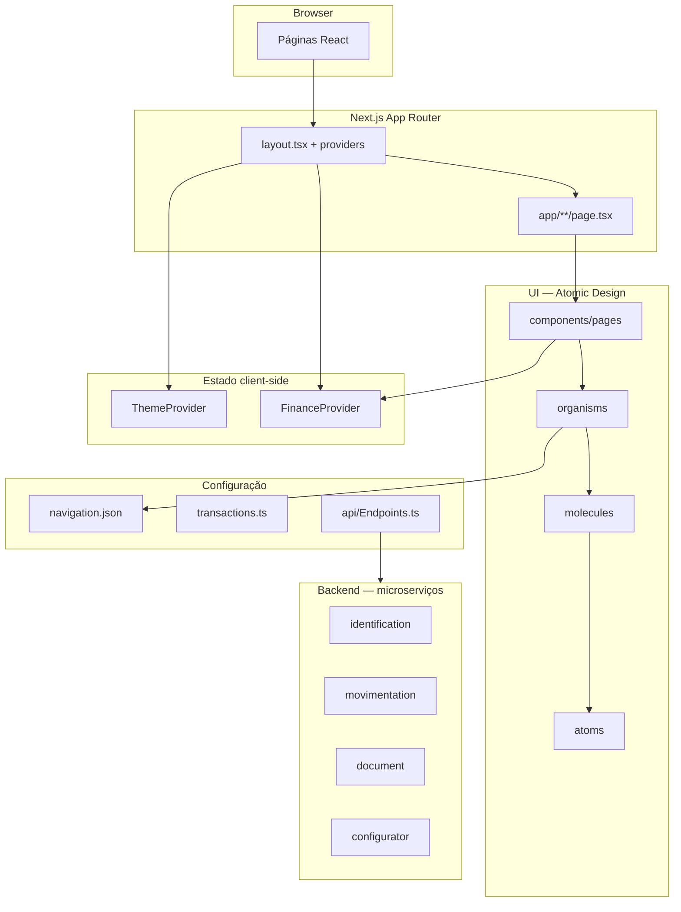

# Finlumia Frontend

Frontend da plataforma **Finlumia** — aplicação web para clareza financeira pessoal e gestão de movimentações. Construído com **Next.js 15** (App Router), **React 19** e **TypeScript**, seguindo **Atomic Design** para a camada de UI e separação por **domínios de serviço** para integração com microserviços de backend.

---

## Índice

- [Visão geral](#visão-geral)
- [Stack tecnológica](#stack-tecnológica)
- [Funcionalidades implementadas](#funcionalidades-implementadas)
- [Arquitetura](#arquitetura)
- [Estrutura de pastas](#estrutura-de-pastas)
- [Rotas da aplicação](#rotas-da-aplicação)
- [Design system e temas](#design-system-e-temas)
- [Estado da aplicação (FinanceProvider)](#estado-da-aplicação-financeprovider)
- [Navegação (Sidebar)](#navegação-sidebar)
- [Integração com backend](#integração-com-backend)
- [Responsividade](#responsividade)
- [Pré-requisitos](#pré-requisitos)
- [Como executar](#como-executar)
- [Variáveis de ambiente](#variáveis-de-ambiente)
- [Scripts npm](#scripts-npm)
- [Docker e Dev Container](#docker-e-dev-container)
- [Convenções de desenvolvimento](#convenções-de-desenvolvimento)
- [Documentação complementar](#documentação-complementar)

---

## Visão geral

A Finlumia centraliza receitas, despesas, orçamentos e relatórios em uma interface única. O frontend é responsável por:

- **Marketing e aquisição** — landing page, login, cadastro e recuperação de senha.
- **Dashboard autenticado** — painel resumido, movimentações, orçamentos, cadastros auxiliares e relatórios.
- **Configurador administrativo** — gestão de metadados de banco (tabelas, campos, usuários, permissões, funções, índices e triggers).
- **Suporte** — abertura de tickets e documentação interna do projeto.

O projeto prioriza **componentização reutilizável**, **tokens de design** para temas claro/escuro alinhados à identidade visual (paleta teal da logo) e **preparação para API** via contratos tipados e catálogo centralizado de endpoints.

---

## Stack tecnológica

| Tecnologia | Versão | Uso |
|------------|--------|-----|
| [Next.js](https://nextjs.org) | 15.x | App Router, SSR/SSG, build e roteamento |
| React | 19.x | Camada de UI e hooks |
| TypeScript | 6.x | Tipagem estática em todo o código |
| CSS Modules | — | Estilos encapsulados por componente |
| CSS global + utilitários | — | Tokens, tema, responsividade |
| ESLint | 10.x | Qualidade e consistência de código |

Ambiente de desenvolvimento em container: **AlmaLinux 10** + **Node.js 24 LTS** (`docker/scripts/finlumia_front.Dockerfile`).

---

## Funcionalidades implementadas

### Público (sem autenticação)

| Rota | Descrição |
|------|-----------|
| `/` | Landing page com hero, recursos, passos, oferta de lançamento, FAQ e CTA |
| `/login` | Autenticação com e-mail/senha e link para cadastro |
| `/register` | Cadastro com validação, medidor de força de senha e aceite de termos |
| `/forgot-password` | Solicitação de redefinição de senha |
| `/reset-password` | Redefinição de senha com token |

### Dashboard (`/dashboard/*`)

| Módulo | Rotas | Descrição |
|--------|-------|-----------|
| **Painel** | `/dashboard` | KPIs e movimentações recentes |
| **Movimentações** | `/dashboard/movimentation/transactions` | Listagem, filtros, novo lançamento e importação |
| | `/dashboard/movimentation/budget` | Orçamentos mensais por setor, forma de pagamento ou banco, com alertas de estouro |
| | `/dashboard/movimentation/categories` | Catálogo de categorias (padrão + personalizadas) |
| | `/dashboard/movimentation/banks` | Catálogo de bancos (padrão + personalizados) |
| | `/dashboard/movimentation/payment-methods` | Formas de pagamento (padrão + personalizadas) |
| **Relatórios** | `/dashboard/reports` | Gráficos e insights financeiros |
| **Configurador** | `/dashboard/configurator/*` | CRUD de metadados (tabelas, campos, usuários, etc.) |
| **Suporte** | `/dashboard/support/ticket` | Abertura de chamados |
| | `/dashboard/support/documentation` | Documentação interna do frontend |

> A rota `/dashboard/movimentation` redireciona automaticamente para `/dashboard/movimentation/transactions`.

---

## Arquitetura

### Diagrama de camadas



### Princípios

1. **App Router** — Cada URL é um `page.tsx` em `src/app/`. Layouts aninhados (`dashboard/layout.tsx`) compartilham sidebar e providers.
2. **Atomic Design** — Granularidade crescente: `atoms` → `molecules` → `organisms` → `pages`. Templates reservados para layouts estruturais futuros.
3. **Separação UI / lógica** — Componentes visuais não chamam API diretamente. Orquestração em `features/` (planejado) e HTTP em `services/<domínio>/`.
4. **Design tokens** — Cores, tipografia e espaçamentos em `src/shared/styles/tokens/`, com fundações `light` e `dark`.
5. **Configuração declarativa** — Menu lateral (`navigation.json`), transações mock (`transactions.ts`) e endpoints (`api/endpoints/*.json`) como fontes de verdade.
6. **Client components onde necessário** — `"use client"` em páginas com hooks, eventos ou contexto (tema, finanças).

### Atomic Design — inventário

| Camada | Responsabilidade | Exemplos |
|--------|------------------|----------|
| **atoms** | Primitivos visuais | `Button`, `Text`, `Icon`, `Image`, `Input`, charts (`BarChart`, `DonutChart`, …) |
| **molecules** | Composição simples | `Logo` |
| **organisms** | Seções complexas | `Header`, `HeroSection`, `Sidebar`, `Modal`, `DataTable`, `CrudModal`, `NewTransactionModal`, `ImportModal` |
| **pages** | Telas completas (sem rota Next) | `LandingPage`, `DashboardPage`, `MovimentationPage`, `BudgetPage`, … |
| **templates** | Layouts estruturais | Reservado |

---

## Estrutura de pastas

```text
finlumia_frontend/
├── .devcontainer/              # Dev Containers (Cursor / VS Code)
├── docker/scripts/             # Dockerfile de desenvolvimento
├── docs/                       # Guias de manutenção de componentes
├── public/assets/              # Assets estáticos (logo, hero, favicon)
├── src/
│   ├── app/                    # App Router — rotas e layouts
│   │   ├── layout.tsx          # Layout raiz (metadata, providers, globals)
│   │   ├── page.tsx            # Landing (/)
│   │   ├── login/              # Autenticação
│   │   ├── register/
│   │   ├── forgot-password/
│   │   ├── reset-password/
│   │   └── dashboard/          # Área autenticada
│   │       ├── layout.tsx      # Sidebar + FinanceProvider + topbar mobile
│   │       ├── dashboard.module.css
│   │       ├── movimentation/  # Transações, orçamento, cadastros
│   │       ├── reports/
│   │       ├── configurator/
│   │       └── support/
│   ├── api/
│   │   ├── Endpoints.ts        # Montagem de URLs por ambiente
│   │   ├── types.ts            # Tipos derivados dos contratos JSON
│   │   └── endpoints/          # Contratos por domínio (*.endpoints.json)
│   ├── assets/                 # SVGs fonte (ex.: icone_finlumia.svg)
│   ├── components/
│   │   ├── atoms/
│   │   ├── molecules/
│   │   ├── organisms/
│   │   ├── pages/
│   │   └── templates/
│   ├── config/
│   │   ├── navigation.json     # Estrutura do menu lateral
│   │   ├── transactions.ts     # Tipos, catálogos padrão e mocks
│   │   ├── reports.ts
│   │   └── configurator.ts
│   ├── features/               # Casos de uso (reservado)
│   ├── services/               # Clientes HTTP por domínio (reservado)
│   └── shared/
│       ├── finance/
│       │   └── finance.context.tsx   # Estado de transações, catálogos e orçamentos
│       ├── styles/
│       │   ├── globals.css
│       │   ├── theme.css
│       │   ├── responsive.css      # Utilitários (.page-responsive, .grid-responsive)
│       │   ├── theme.context.tsx
│       │   └── tokens/
│       └── constants/ | hooks/ | utils/ | types/
├── finlumia.ps1                # Automação Docker (Windows)
├── next.config.ts
├── package.json
└── tsconfig.json
```

**Alias de importação:** `@/*` → `src/*` (configurado em `tsconfig.json`).

---

## Rotas da aplicação

### Fluxo de renderização

1. Usuário acessa uma URL (ex.: `/dashboard/movimentation/budget`).
2. Next.js resolve `src/app/dashboard/movimentation/budget/page.tsx`.
3. `src/app/layout.tsx` envolve com `ThemeProvider` e estilos globais.
4. `src/app/dashboard/layout.tsx` adiciona `FinanceProvider`, `Sidebar`, topbar mobile e container centralizado.
5. A page importa o componente de `components/pages/` e renderiza.

### Metadata

Rotas públicas e de dashboard definem `metadata` (title, description) nos respectivos `page.tsx` para SEO e abas do navegador.

---

## Design system e temas

### Paleta

A identidade visual segue a **logo Finlumia** (gradiente teal). Tokens em:

- `src/shared/styles/tokens/foundation/light.ts`
- `src/shared/styles/tokens/foundation/dark.ts`

Categorias de token: `brand`, `bg`, `text`, `border`, `feedback` (success, warning, error, info).

### Alternância de tema

| Recurso | Caminho |
|---------|---------|
| Contexto React | `src/shared/styles/theme.context.tsx` |
| Persistência | `localStorage` (`finlumia-theme`) |
| Atributo DOM | `data-theme="light"` \| `"dark"` em `<html>` |
| Gradientes de fundo | `src/shared/styles/theme.css` |

O clique no ícone do logo alterna entre claro e escuro.

### Utilitários responsivos

Definidos em `src/shared/styles/responsive.css`:

| Classe | Comportamento |
|--------|---------------|
| `.page-responsive` | Container de página com padding responsivo, `max-width` e **centralização horizontal** (`margin-inline: auto`) |
| `.grid-responsive` | Grid que empilha em mobile e usa `--grid-cols` no desktop |
| `.grid-pair` | Grid 2 colunas a partir de 640px |
| `.scroll-x` | Scroll horizontal para tabelas largas |

Variável CSS opcional: `--page-max-width` (padrão `120rem`) para ajustar largura máxima por página.

---

## Estado da aplicação (FinanceProvider)

`src/shared/finance/finance.context.tsx` centraliza dados financeiros no dashboard (client-side, com persistência em `localStorage` até integração com API).

### Responsabilidades

| Domínio | Operações |
|---------|-----------|
| **Categorias** | Lista padrão + customizadas; `addCategory`, `removeCategory` |
| **Bancos** | Lista padrão + customizados; `addBank`, `removeBank` |
| **Formas de pagamento** | Lista padrão + customizadas; `addPaymentMethod`, `removePaymentMethod` |
| **Transações** | CRUD em memória; `addTransaction`, `addTransactions`, `removeTransaction` |
| **Orçamentos** | Limites mensais; `addBudget`, `updateBudget`, `removeBudget` |
| **Status de orçamento** | `budgetStatusFor(month)` — calcula gasto, restante, % e flag `exceeded` |

### Escopos de orçamento

- `global` — todas as despesas do mês
- `category` — por setor/categoria
- `method` — por forma de pagamento
- `bank` — por instituição financeira

### Chaves de persistência (localStorage)

```text
finlumia-custom-categories
finlumia-custom-banks
finlumia-custom-methods
finlumia-budgets
finlumia-transactions
```

### Uso em componentes

```tsx
import { useFinance } from "@/shared/finance/finance.context";

const { categories, addTransaction, budgetStatusFor } = useFinance();
```

O hook lança erro se usado fora de `FinanceProvider` (montado em `dashboard/layout.tsx`).

---

## Navegação (Sidebar)

A estrutura do menu é **declarativa** em `src/config/navigation.json`:

```json
{
  "sidebar": {
    "version": "1.1.0",
    "groups": [
      { "id": "main", "items": [ /* Painel */ ] },
      { "id": "management", "items": [ /* Configurador, Movimentações, Relatórios */ ] },
      { "id": "help", "items": [ /* Suporte */ ] }
    ]
  }
}
```

Cada item suporta: `id`, `label`, `icon`, `href`, `exact`, `children` (submenus).

O componente `Sidebar` (`src/components/organisms/Sidebar/Sidebar.tsx`):

- Lê `navigation.json` e mapeia ícones SVG inline.
- Suporta **colapso** no desktop (icon rail) e **drawer off-canvas** no mobile/tablet.
- Botão **Sair** redireciona para `/` (landing).
- Estado controlado pelo `dashboard/layout.tsx` (`collapsed`, `mobileOpen`).

---

## Integração com backend

### Catálogo de endpoints

`src/api/Endpoints.ts` monta URLs no formato:

```text
{base_do_servico}/{versao}{caminho}
```

| Domínio | Serviço | Pasta em `services/` |
|---------|---------|----------------------|
| Autenticação / perfil | identification | `identification/` |
| Transações / importação | movimentation | `movimentation/` |
| Relatórios / documentos | document | `document/` |
| Metadados admin | configurator | `configurator/` |

Contratos OpenAPI-like em `src/api/endpoints/*.endpoints.json`. Tipos TypeScript gerados/derivados em `src/api/types.ts`.

### Ambientes

Controlados por `NEXT_PUBLIC_APP_ENV`: `local` | `homologation` | `production`.

Cada serviço possui variável `NEXT_PUBLIC_SERVICE_*_{ENV}` (ver `.env.example`).

> **Nota:** A camada `services/` está preparada (pastas com `.gitkeep`); as telas atuais usam mocks e `FinanceProvider` até a API estar disponível.

---

## Responsividade

Breakpoints principais:

| Viewport | Comportamento |
|----------|---------------|
| `< 640px` | Mobile — sidebar em drawer, topbar fixa, grids empilhados |
| `640px – 1023px` | Tablet — mesmo drawer, mais padding |
| `≥ 1024px` | Desktop — sidebar persistente, conteúdo com offset `--sidebar-width` |

### Centralização do conteúdo

O conteúdo das telas do dashboard fica **centralizado na área útil** (espaço à direita da sidebar):

1. `.mainInner` no `dashboard/layout.tsx` — `max-width: 140rem`, `margin-inline: auto`
2. `.page-responsive` — `max-width` (padrão `120rem`) + `margin-inline: auto` em cada página

Isso evita que cards e tabelas fiquem colados à esquerda em monitores ultrawide.

---

## Pré-requisitos

Escolha **uma** forma de desenvolvimento:

| Modo | Requisitos |
|------|------------|
| **Local** | Node.js 20+ (recomendado 24 LTS), npm |
| **Docker** | Docker Desktop, PowerShell |
| **Dev Container** | Docker Desktop + Cursor/VS Code com extensão Dev Containers |

---

## Como executar

### Local (Node.js)

```bash
npm install
cp .env.example .env.local   # Windows: copy .env.example .env.local
npm run dev
```

Abra [http://localhost:3000](http://localhost:3000).

### Docker (`finlumia.ps1`)

```powershell
./finlumia.ps1 -up              # Sobe container + dev server
./finlumia.ps1 -up -Build       # Rebuild da imagem
./finlumia.ps1 -Logs            # Logs
./finlumia.ps1 -Shell           # Shell no container
./finlumia.ps1 -down            # Para e remove
```

Repositório montado em `/workspace` no container. App em [http://localhost:3000](http://localhost:3000).

### Dev Container

1. Abra o repositório no Cursor/VS Code.
2. **Dev Containers: Reopen in Container**.
3. No terminal integrado:

```bash
npm run dev -- --hostname 0.0.0.0 --port 3000
```

### Build de produção

```bash
npm run build
npm run start
```

---

## Variáveis de ambiente

Copie `.env.example` → `.env.local`:

| Variável | Descrição |
|----------|-----------|
| `NEXT_PUBLIC_APP_ENV` | `local`, `homologation` ou `production` |
| `NEXT_PUBLIC_API_VERSION` | Versão da API (ex.: `v1`) |
| `NEXT_PUBLIC_SERVICE_*_LOCAL` | URL base de cada microserviço (dev) |
| `NEXT_PUBLIC_SERVICE_*_HOMOLOGATION` | URL em homologação |
| `NEXT_PUBLIC_SERVICE_*_PRODUCTION` | URL em produção |
| `NEXT_PUBLIC_GOOGLE_CLIENT_ID` | OAuth Google (cadastro/login social) |
| `NEXT_PUBLIC_FEATURE_IMPORT_ENABLED` | Feature flag de importação |
| `NEXT_PUBLIC_FEATURE_MFA_ENABLED` | Feature flag de MFA |

Somente variáveis `NEXT_PUBLIC_*` são expostas ao browser.

---

## Scripts npm

| Comando | Descrição |
|---------|-----------|
| `npm run dev` | Servidor de desenvolvimento (porta 3000) |
| `npm run build` | Build de produção |
| `npm run start` | Servidor após build |
| `npm run lint` | ESLint |

### Typecheck (sem script dedicado)

```bash
node ./node_modules/typescript/bin/tsc --noEmit
```

---

## Docker e Dev Container

| Recurso | Caminho |
|---------|---------|
| Dockerfile | `docker/scripts/finlumia_front.Dockerfile` |
| Dev Container | `.devcontainer/devcontainer.json` |
| Script PowerShell | `finlumia.ps1` |

Imagem: AlmaLinux 10, Node.js 24, Git, gcc-c++, python3, Docker CLI.

---

## Convenções de desenvolvimento

### Adicionar uma rota

```text
src/app/minha-rota/page.tsx  →  /minha-rota
```

```tsx
import { MinhaPage } from "@/components/pages/MinhaPage";

export const metadata = {
  title: "Minha rota | Finlumia",
  description: "...",
};

export default function Page() {
  return <MinhaPage />;
}
```

Use `"use client"` quando a page ou componente usar hooks, eventos ou contexto.

### Adicionar item ao menu

1. Edite `src/config/navigation.json` (item ou `children`).
2. Se o ícone for novo, registre-o no mapa `ICONS` em `Sidebar.tsx`.

### Adicionar componente (Atomic Design)

1. Crie a pasta em `atoms/`, `molecules/` ou `organisms/`.
2. Exporte via `index.ts`.
3. Consuma em `components/pages/` — não importe atoms diretamente em `app/` quando possível.

### Estilos

- **CSS Modules** (`.module.css`) para layout e estados de componentes.
- **Inline `style`** com tokens de `getFoundationByTheme(theme)` para cores dinâmicas.
- **Classes globais** (`.page-responsive`, `.grid-responsive`) para padrões repetidos.

### Commits e PRs

- Mensagens claras focadas no *porquê*.
- PRs pequenos e revisáveis por módulo (UI, rotas, config).
- Não commitar `.env.local` nem segredos.

---

## Documentação complementar

| Documento | Conteúdo |
|-----------|----------|
| [src/ARCHITECTURE.md](src/ARCHITECTURE.md) | Regras de arquitetura detalhadas |
| [docs/header-maintenance-guide.md](docs/header-maintenance-guide.md) | Manutenção do Header |
| [docs/atoms-and-hero-maintenance-guide.md](docs/atoms-and-hero-maintenance-guide.md) | Atoms e HeroSection |
| [workspace/README.md](workspace/README.md) | Mount host → `/workspace` no container |

---

## Licença

Projeto privado (`"private": true` em `package.json`).
